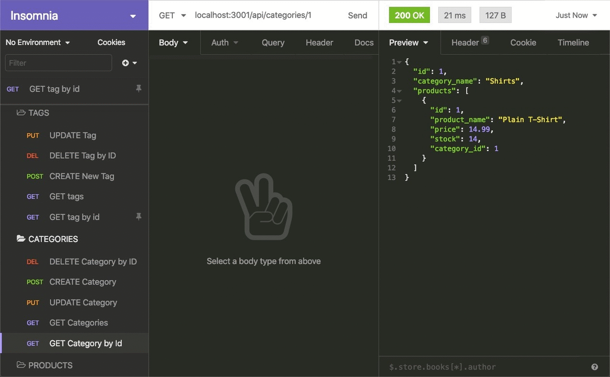

# E-commerce Backend
  
  
## Description
This module is an example of an e-commerce back end site. The user takes a working express.js API and configures it to use Sequelize to interact with MySQL database.

## Table of Contents
- [Description](#description)
- [Installation](#installation)
- [Usage](#usage)
- [License](#license)
- [Links](#links)
- [Questions](#questions)
- [Author](#author)
## Installation
To take full advantage of the project node and npm are required to be installed.

If the user wants to install on their own device. Follow these steps

```sh
$ git clone https://github.com/potter0316/e-commerce-back-end-.git
$ cd e-commerce-back-end
```

## Usage
Demonstration of the Use of insomnia

GET routes for all categories, all products, and all tages being tested in Insomnia.

GET routes for a single category, a single product, and a single tage being tested in Insomnia.

POST, PUT, and DELETE routes for categories, products, and a single tag being tested in Insomnia.


Demonstration of different routes created in insomnia!
## Links
Walkthrough link! link: [https://drive.google.com/file/d/19UURHdr6WcJGRt_rm5u1A-9SfbREdO46/view] (screencastify)
## License
MIT
## Author
Michael Potter
Email: [potter0316@gmail.com](mailto:potter0316@gmail.com)
Github: [potter0316](https://github.com/potter0316)
